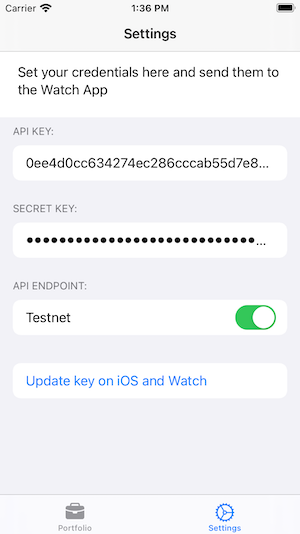

## TradeNet Portfolio

Manage your earnings easily from your phone and watch!

## Usage

1) Install the app on your iPhone and then add it to your Apple Watch using the Watch App.

2) Run the app on your phone and open the settings tab.

3) Fill in your Binance (or Binance Testnet) API key and secret and click on save. Keys will be automatically synced to the  Apple Watch.

4) Add some complications to your Apple Watch and enjoy!

If you have any issues feel free to contact us at [appstore@rodriguezst.es](mailto:appstore@rodriguezst.es).

### Privacy Policy

See the [Privacy Policy](./POLICY.md).

<!-- ### Terms of Service -->

<!-- See the [Terms of Service](./TOS.md). -->
